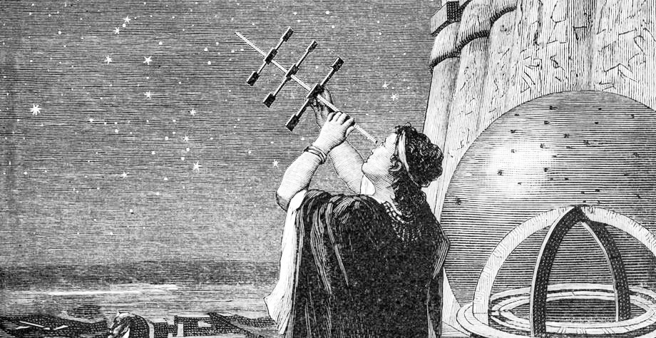

Hypatia is a geo-astronomical library based on the work of  [Jean Meeus](https://en.wikipedia.org/wiki/Jean_Meeus), [Mark Huss](http://mhuss.com/AstroLib), [Bill Gray](https://github.com/Bill-Gray ), [Stuart Lowe](http://mhuss.com/AstroLib), [Brandon Rhodes](https://github.com/brandon-rhodes/pyephem) , [Daniel Warner](https://github.com/dnwrnr/sgp4), [Oliver Montenbruck and Thomas Peleger](https://www.amazon.com/gp/product/3540672214/ref=oh_aui_detailpage_o00_s00?ie=UTF8&psc=1). Was created mostly for educational purposes, but also to use in different personal artistic projects. 

In comparison with other astronomical/geographical libraries created for profesional uses Hypatia have a focus on: 
* reusability and portability
* realtime performance
* simplicity of the interface, than other 

## Hypatia as C++ lib

You can easily add hypatia into your project by adding the `include/` and `src/` folder or by installing hypatia into your system. For the former option you need to:

```bash
sudo apt install cmake swig
mkdir build
cd build
cmake ..
make
sudo make install
```

```cpp
#include <sstream>

#include "hypatia/Body.h"
#include "hypatia/Luna.h"
#include "hypatia/Constellation.h"

void main(int argc, char **argv) {

    obs = Observer(40.781098831465, -73.97715657655);

    sun = Body(SUN);
    moon = Luna(LUNA);
    std::cout << "Moon's phase: " << moon.getPhase() << std::endl

    const = Constellation(moon)
    std::cout << "Moon's transit constelation: " << const.getName() << std::endl

    return 0;
}
```

## Hypatia as Python module

First you need to create the package and install it

```bash
sudo apt install swig
make install
```

**Note**: to install inside anaconda do:
```bash
/anaconda3/bin/./python3.7 setup.py install 
```

Then you can use it as follow:

```python
from hypatia import *

obs = Observer(40.781098831465, -73.97715657655)

sun = Body(SUN)
sun.compute(obs)

moon = Luna(LUNA)
moon.compute(obs)
print("Moon's phase: ", const.getPhase())

const = Constellation(moon)
print("Moon's transit constelation: ", const.getName())
```

# License

hypatia is open source. You may use, extend, and redistribute without charge under the terms of the [BSD license](LICENSE).

```
Copyright (c) 2018, Patricio Gonzalez Vivo
All rights reserved.

Redistribution and use in source and binary forms, with or without modification, 
are permitted provided that the following conditions are met:

1. Redistributions of source code must retain the above copyright notice, this
list of conditions and the following disclaimer.

2. Redistributions in binary form must reproduce the above copyright notice, this
list of conditions and the following disclaimer in the documentation and/or other
materials provided with the distribution.

THIS SOFTWARE IS PROVIDED BY THE COPYRIGHT HOLDERS AND CONTRIBUTORS "AS IS" AND 
ANY EXPRESS OR IMPLIED WARRANTIES, INCLUDING, BUT NOT LIMITED TO, THE IMPLIED 
WARRANTIES OF MERCHANTABILITY AND FITNESS FOR A PARTICULAR PURPOSE ARE DISCLAIMED. 
IN NO EVENT SHALL THE COPYRIGHT HOLDER OR CONTRIBUTORS BE LIABLE FOR ANY DIRECT, 
INDIRECT, INCIDENTAL, SPECIAL, EXEMPLARY, OR CONSEQUENTIAL DAMAGES (INCLUDING, 
BUT NOT LIMITED TO, PROCUREMENT OF SUBSTITUTE GOODS OR SERVICES; LOSS OF USE, 
DATA, OR PROFITS; OR BUSINESS INTERRUPTION) HOWEVER CAUSED AND ON ANY THEORY OF 
LIABILITY, WHETHER IN CONTRACT, STRICT LIABILITY, OR TORT (INCLUDING NEGLIGENCE 
OR OTHERWISE) ARISING IN ANY WAY OUT OF THE USE OF THIS SOFTWARE, EVEN IF ADVISED OF
THE POSSIBILITY OF SUCH DAMAGE.
```